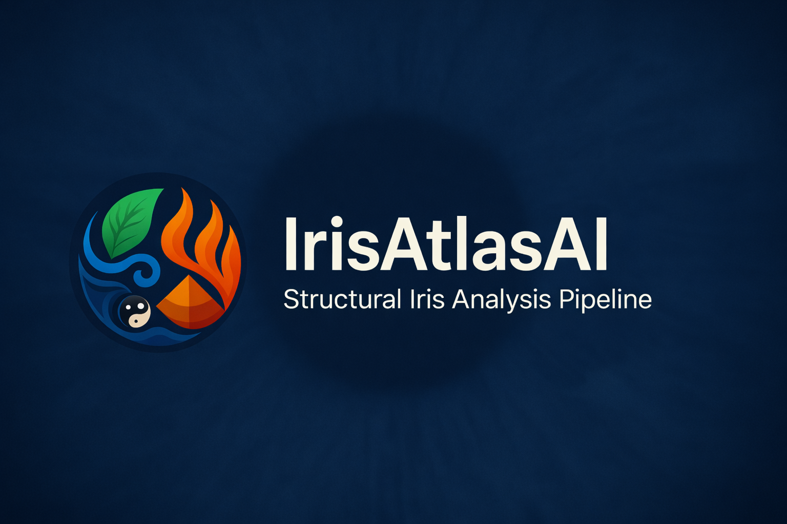

<p align="center">
  
</p>

# 🌿 IrisVisionAI — Research-Grade Structural Iris Analysis Pipeline (NIR)

A complete scientific pipeline for **structural iris analysis** using Near-Infrared (NIR) datasets such as **CASIA-IrisV4**.  
This repository implements segmentation, micro-feature detection, clock-sector mapping, and interpretation layers (rule-based + VLM).

# 📘 Repository Use Case — What This Project Is For

This project provides a research-grade pipeline for **computational iridology**, focusing solely on **structural iris features** visible under NIR:

### ✔ Anatomical Iris Segmentation  
- Iris boundary  
- Pupil boundary  
- Collarette  
- Contraction furrows  
- Scurf rim  

### ✔ Micro-feature Detection (NIR-visible)
- Lacunae (medium–large)
- Crypts (medium–large)
- Structural patches

### ✔ Clock-Sector Mapping  
Using polar transformation + iris center detection.

### ✔ Structured Output  
- JSON map  
- Visual overlays  
- Structural interpretation (rule-based + VLM)

**⚠️ NOTE:**  
Color-based iridology (pigments, stages, chroma) is **not possible in NIR** and deferred to **v2.0 (RGB dataset)**.

---

# 🎯 Primary Research Purpose

This project is meant for:

- Iris biometrics research  
- Medical imaging analysis  
- Structural iridology research  
- Feature extraction and mapping studies  
- Building reproducible NIR iris workflows  

It is **NOT** a diagnostic tool.

---

# 📌 Why NIR?

NIR offers:

- High structural clarity  
- Consistent imaging  
- No glare/reflection  
- BUT — removes all iris color information

Thus this project is **structural-only**, not chromatic.

---

# 🧱 What This Repository Includes

- Dataset prep scripts (cropper, QC)
- SAM-assisted annotation helpers
- CVAT annotation workflow
- nnU-Net segmentation training
- YOLO micro-feature detection training
- Polar mapping + sector assignment
- Structural interpretation engine (rule-based + VLM)
- Full pipeline CLI
- Documentation & experiment templates

---

# 🚫 What This Repository Does NOT Include

These require RGB iris datasets (planned in v2.0):

- Pigment color interpretation  
- Iris color typology  
- Toxicity stages  
- Psora/lymph pigments  
- Chromatic rings  
- Emotional/color analysis  

---

# 💡 End-To-End Output

Given an input iris image:

1. Segmentation mask  
2. Micro-feature detections  
3. Sector mapping  
4. Structural interpretation  
5. Visual overlays  
6. JSON + PDF export  

---

# 🧠 Pipeline Overview
```
Dataset → Annotation → Segmentation → Detection → Sector Mapping → Interpretation → Reporting
```

---

## 📁 Repository Structure

```text
workspace/
├── infra/                  # Infrastructure and supporting systems
│   ├── backups/
│   ├── datasets/
│   ├── environments/
│   ├── frameworks/
│   │   └── nnunet/
│   ├── logs/
│   └── tools/
│
└── projects/
    └── IrisVisionAI/       # Main research repository
        ├── configs/
        ├── data/
        ├── docs/
        ├── experiments/
        ├── models/
        ├── notebooks/
        ├── outputs/
        ├── src/
        ├── tests/
        └── README.md
```

---

# 📚 Documentation
All documentation is inside `/docs`:
- MODEL_OVERVIEW.md
- ANNOTATION_SPEC.md
- DATASET_DATASHEET.md
- PREPROCESSING.md
- TRAINING_RECIPES.md
- EVALUATION.md
- REPRODUCIBILITY.md
- MODEL_CARD.md
- VLM_PROMPTS.md  

---

# 📌 VERSION CHECKLIST (TABLE + CHECKBOXES)

# IrisVisionAI — Project Roadmap & Version Protocol

This roadmap defines **strict version boundaries** for the IrisVisionAI research pipeline.  
Each version authorizes **exactly one class of irreversible actions**.

---

## v0.1 — Project Initialization (Complete)

| Task | Status |
|------|--------|
| Define project scope & research intent | ✔ |
| Create repository & folder structure | ✔ |
| Infra vs project separation | ✔ |
| Add README & core documentation | ✔ |
| Add license, disclaimer, security policy | ✔ |
| Environment & tooling setup | ✔ |

---

## v0.2 — Dataset Preparation & Audit (Complete)

### Dataset Scope & Policy
| Task | Status |
|------|--------|
| Select primary dataset (CASIA-Iris-Interval) | ✔ |
| Lock dataset | ✔ |
| Archive non-primary datasets | ✔ |

### Dataset Ingestion
| Task | Status |
|------|--------|
| Download dataset | ✔ |
| Store raw data (unmodified) | ✔ |
| Verify directory consistency | ✔ |

### Dataset Audit
| Task | Status |
|------|--------|
| Count total images | ✔ |
| Inspect subject-wise structure | ✔ |
| Verify resolution & format | ✔ |
| Document filename conventions | ✔ |

### Quality Control (QC)
| Task | Status |
|------|--------|
| Detect corrupted images | ✔ |
| Flag blur / occlusion | ✔ |
| Log exclusions | ✔ |

### Metadata
| Task | Status |
|------|--------|
| Define metadata schema | ✔ |
| Generate metadata.csv | ✔ |
| Include QC flags | ✔ |

**Restrictions**
- No dataset splitting  
- No annotation  
- No model training  

---

## v0.3 — Dataset Split & Annotation Readiness (Complete)

### Dataset Splits
| Task | Status |
|------|--------|
| Subject-disjoint train/val/test split | ✔ |
| Fixed random seed (69) | ✔ |
| Save split manifest | ✔ |
| Generate split summary | ✔ |

### Metadata Finalization
| Task | Status |
|------|--------|
| Populate `split` column | ✔ |
| Preserve QC flags | ✔ |

### Structural Readiness
| Task | Status |
|------|--------|
| Prepare split-aware folder structure | ✔ |
| Write SPLITS.md documentation | ✔ |
| Explicitly defer annotation | ✔ |

**Split is frozen permanently from this version onward.**

---

## v0.4 — Segmentation Annotation (SAM + CVAT)

| Task | Status |
|------|--------|
| Define annotation protocol | ✔ |
| Generate SAM proposals (assistive only) | ⏳ |
| Manual correction in CVAT | ⏳ |
| Annotate iris / pupil / occlusions | ⏳ |
| QA review (subset) | ⏳ |
| Export COCO segmentation | ⏳ |
| Save final masks | ⏳ |

**Restrictions**
- No model training  

---

## v0.5 — Segmentation Model Training (nnU-Net)

| Task | Status |
|------|--------|
| Convert dataset to nnU-Net format | ⏳ |
| Verify preprocessing | ⏳ |
| Train nnU-Net model | ⏳ |
| Validate Dice / IoU metrics | ⏳ |
| Save checkpoints & configs | ⏳ |

---

## v0.6 — Micro-feature Annotation (YOLO)

| Task | Status |
|------|--------|
| Define lacuna / crypt taxonomy | ⏳ |
| Annotate micro-features | ⏳ |
| Export YOLO labels | ⏳ |
| QA pass | ⏳ |

---

## v0.7 — Detection Model Training

| Task | Status |
|------|--------|
| Train YOLOv8 / YOLOv10 | ⏳ |
| Evaluate AP / PR curves | ⏳ |
| Error analysis | ⏳ |
| Relabel if needed | ⏳ |
| Save final weights | ⏳ |

---

## v0.8 — Sector Mapping Engine

| Task | Status |
|------|--------|
| Iris center extraction | ⏳ |
| Polar transformation | ⏳ |
| Sector definition (12 / 24) | ⏳ |
| Map detections to sectors | ⏳ |

---

## v0.9 — Rule-Based Interpretation

| Task | Status |
|------|--------|
| Define structural rules | ⏳ |
| Implement rule engine | ⏳ |
| Generate textual summaries | ⏳ |
| Validate consistency | ⏳ |

---

## v0.10 — VLM Interpretation (Explanation Only)

| Task | Status |
|------|--------|
| Select VLM | ⏳ |
| Define prompt templates | ⏳ |
| Generate natural-language explanations | ⏳ |
| Merge with rule-based output | ⏳ |

**Restrictions**
- No decision-making  
- No diagnostic claims  

---

## v1.0 — Alpha Release (Complete Pipeline)

| Task | Status |
|------|--------|
| End-to-end pipeline runner | ⏳ |
| Visual overlays | ⏳ |
| JSON & PDF reports | ⏳ |
| Reproducibility validation | ⏳ |
| Final documentation | ⏳ |

---

## Governing Rule

> If a step which injects **human knowledge**, it will occur **after v0.3**.  
> If a step which injects **machine learning**, it will occur **after annotation**.

This protocol is followed methodological validity, reproducibility, and research integrity.

---

# 🔮 **v2.0 — RGB Expansion (TBA)**  
Requires color-visible datasets.

### Planned Features:
- Pigment color analysis  
- Iris color typing  
- Toxicity rings  
- Psora/Toxemia pigments  
- Acute–Chronic color stages  
- Emotional/color rings  

---

# ⚠️ Current Limitations

- NIR images = **no color information**  
- NIR model will **NOT generalize to RGB**  
- Fine micro-features may be too small in NIR  
- No medical diagnosis intended  
- CASIA dataset cannot be redistributed  

---

# 📜 Citation
“Portions of the research in this work use the CASIA-IrisV4 dataset collected by the Chinese Academy of Sciences’ Institute of Automation.”

---

# 🤝 Contributing
- PRs welcome  
- Use feature branches  
- Follow formatting (black, ruff)  
- Add tests for new code  

---

# 🛡 License
MIT License.

---

# 👤 Author
**Vishal N**  
Founder - Praneon, IrisVisionAI  
BNYS Final Year, Intern

---


